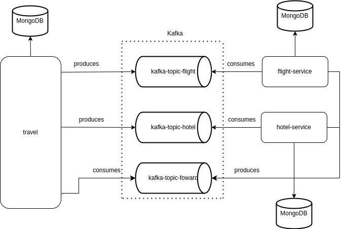

# saga-pattern-study :airplane: :hotel: :credit_card:

This project do proposal to study a software architectural pattern called [Saga](https://microservices.io/patterns/data/saga.html), when we've microservices that comunicate each other with consistency approach. In other words, each microservice or component, should be wait for previous microservice for continuous the request flow.

## use case
For this study, i will approach a travel payment system with three steps or Saga orchestrator, when the step 1 send the request to a kafka topic and the same, send the request back and again, the step send the request to a fligh booking and get the response. Every step follow the same flow with difference of the final service, that are hotel booking and payment.

## architecture

